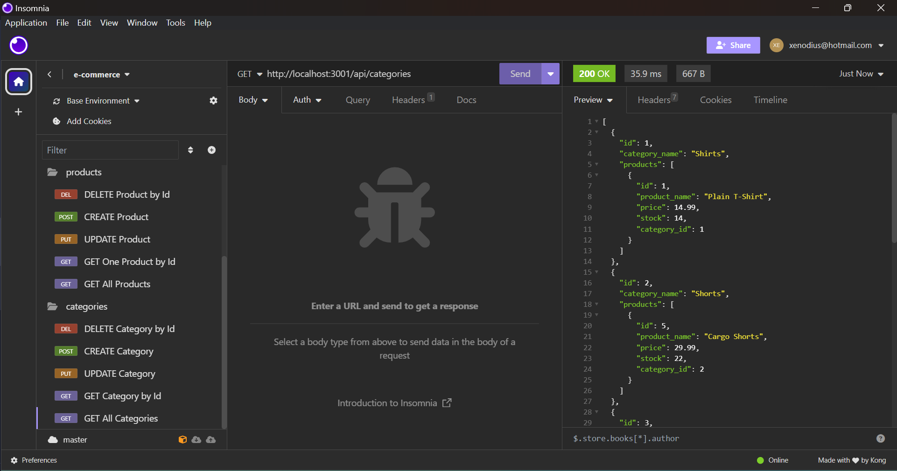
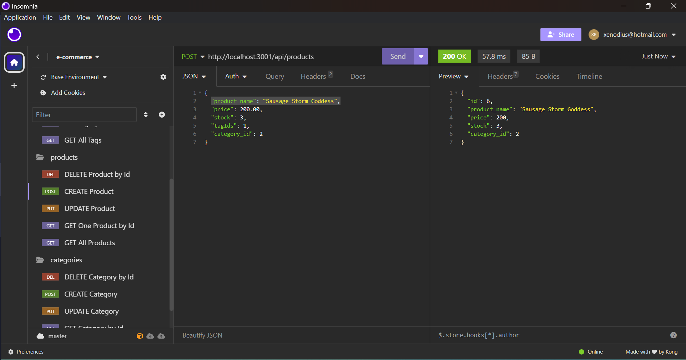
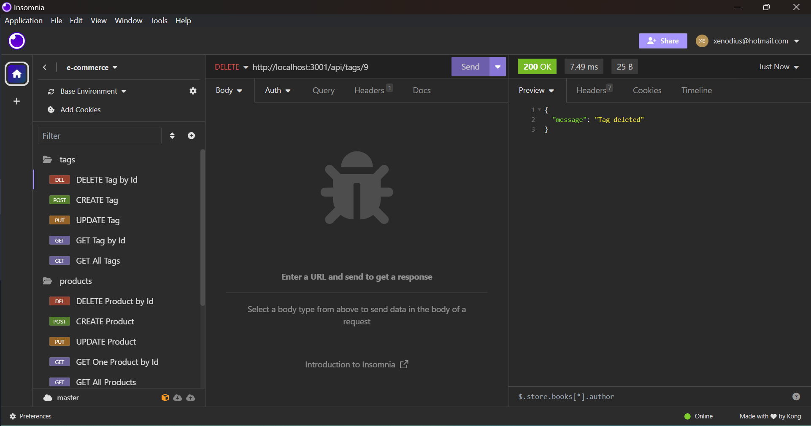
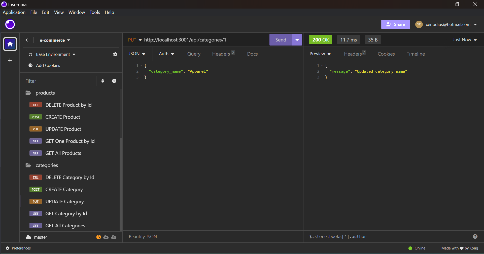

# E-Commerce ORM Application

## Overview

This backend application serves as the foundation for your internet retail company's e-commerce website. Built using the latest technologies, it provides a robust Express.js API integrated with a MySQL database through Sequelize, ensuring seamless connectivity and efficient data management. By utilizing this backend, your company aims to stay competitive in the ever-evolving landscape of e-commerce.

## Installation

1. **Clone the Repository:**
   ```
   git clone https://github.com/XenodiusAlpha/retail_e_commerce.git
   ```

2. **Navigate to the Project Directory:**

3. **Install Dependencies:**
   ```
   npm install
   ```

4. **Database Setup:**
   - Create a file named `.env` in the project root.
   - Add the following lines to the `.env` file, replacing `your_database`, `your_username`, and `your_password` with your actual database credentials:
     ```
     DB_NAME=ecommerce_db
     DB_USER=your_username
     DB_PASSWORD=your_password
     ```

5. **Create Database:**
    - Navigate to db folder, and run `mysql`, followed by entering your credentials
   ```
   mysql
   ```
    - Run your source schema.sql file.
   ```
   SOURCE schema.sql;
   ```

    - Run Seed Command:
   ```
   npm run seed
   ```

## Usage

1. **Start the Server:**
   ```
   npm start
   ```

2. **Access API Routes:**
   - Categories: `http://localhost:3001/api/categories`
   - Products: `http://localhost:3001/api/products`
   - Tags: `http://localhost:3001/api/tags`

3. **Testing API Routes:**
   - Use a tool like [Insomnia Core](https://insomnia.rest/download) to interact with the API.
   - Perform GET requests to view data in a formatted JSON.
   - Test POST, PUT, and DELETE routes to create, update, and delete data in the database.

## Technology Stack

- **Express.js:** Fast, un-opinionated, minimalist web framework for Node.js.
- **Sequelize:** Promise-based Node.js ORM for MySQL.
- **MySQL:** Popular open-source relational database management system.

## Contributing

Contributions are welcome! Please follow the [contribution guidelines](CONTRIBUTING.md).

## License

This project is licensed under the [MIT License](LICENSE).

## Screenshots





## Videolink


## Contact

For inquiries, please contact XenodiusAlpha at [xenodius@hotmail.com].
https://github.com/XenodiusAlpha/retail_e_commerce

Thank you for choosing our e-commerce backend solution!